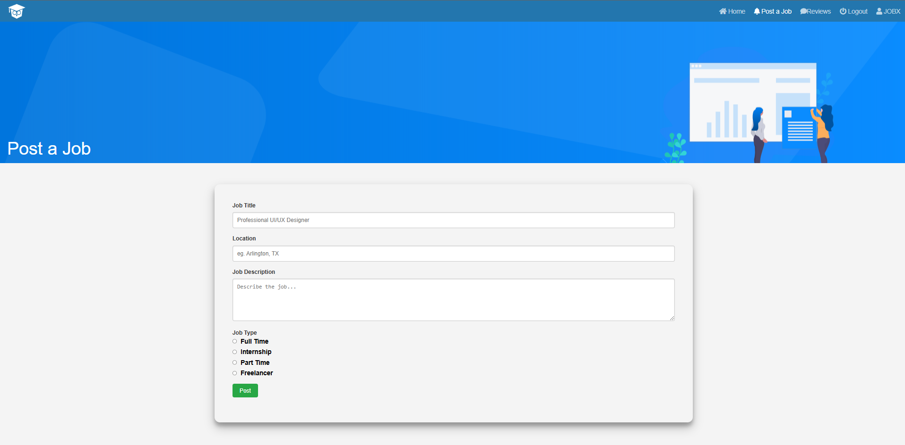

# Career Quest

## Overview

#### Career Quest

Project Description: Career Quest

Introduction:
The Career project aims to provide a comprehensive platform for job seekers to find suitable employment opportunities and for employers to connect with potential candidates efficiently. Utilizing HTML, CSS, JavaScript, PHP, and MariaDB, this web application offers features such as user authentication, job posting, application management, and administrative controls.

Key Features:

User Authentication:
Login: Job seekers, employers, and administrators can log in securely to access their respective accounts.
Logout: Users can securely log out of their accounts to ensure data privacy.

Role-based Access:
Job Seeker Login: Individuals seeking job opportunities can log in to search for jobs, apply for positions, and manage their applications.

Employer Login: Companies and recruiters can log in to post job vacancies, review applications, and manage hiring processes.

Admin Login: Administrators have access to the backend system to manage user accounts, oversee job postings, and ensure platform integrity.

Job Posting:
Employer Dashboard: Employers can create and manage job postings, providing detailed job descriptions, requirements, and application instructions.

Job Search: Job seekers can browse through available job listings based on criteria such as job title, location, and industry.

Application Management:
Apply for Job: Job seekers can apply for positions by submitting their resumes and relevant documents through the portal.

Application Review: Employers can review received applications, shortlist candidates, and communicate with applicants regarding the status of their applications.

Accept or Reject Applicants: Employers can accept or reject job applications based on their suitability for the position.

## Screenshots

  

  

  

## Contributors 

-  [Pakshal Mahavir Ranawat](https://ranawatpakshal.co.in/) 
   
   
